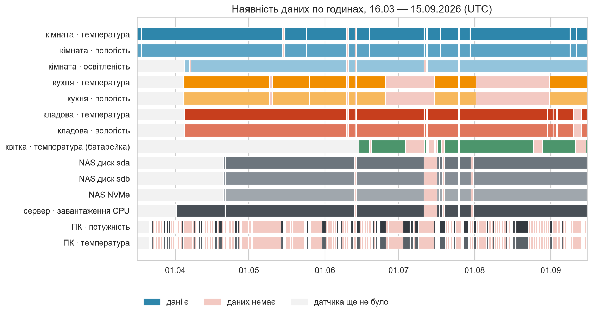
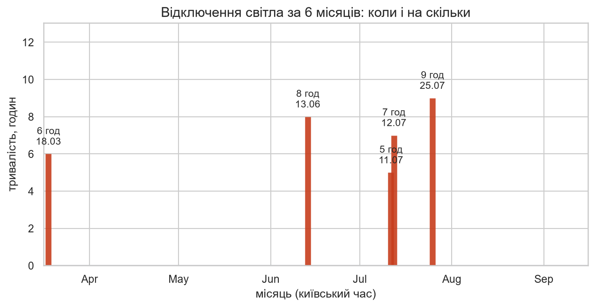
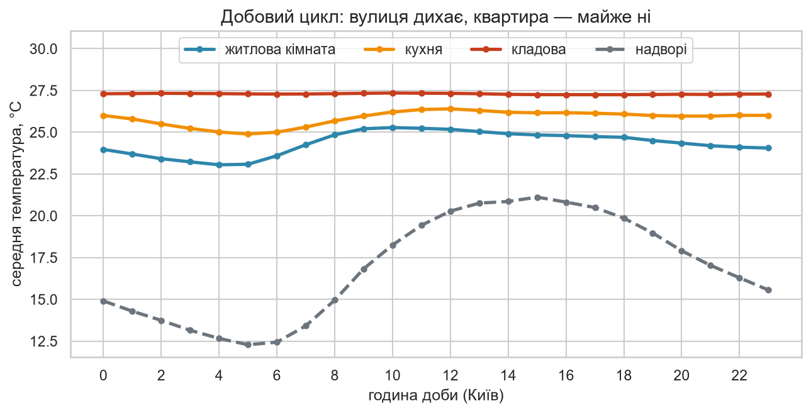
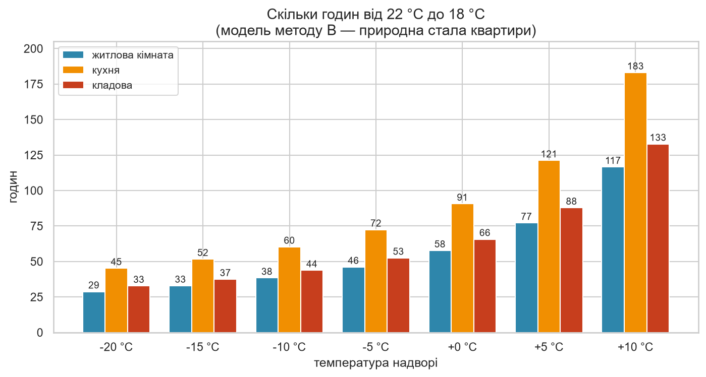
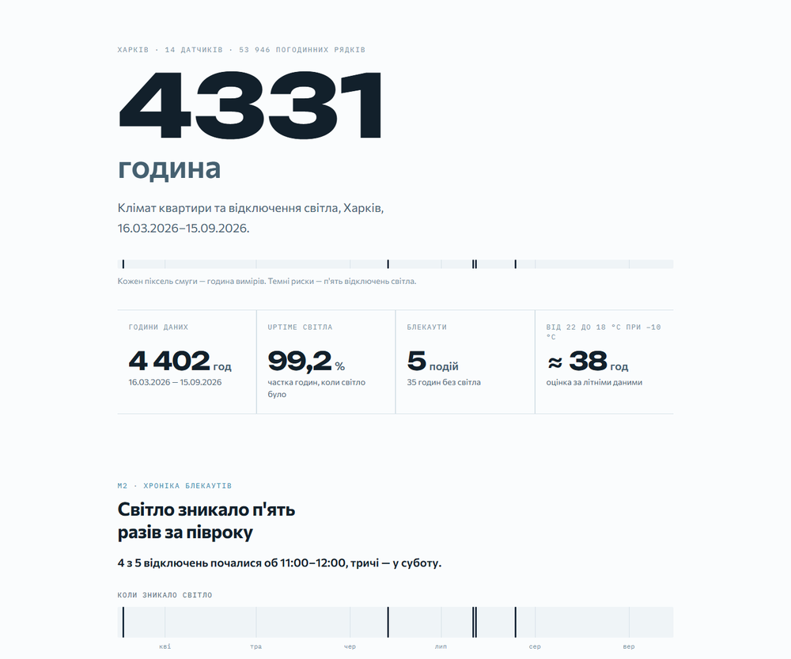

# 4331 Hours

*[Українська версія / Ukrainian version →](README.uk.md)*

Operational analytics on real sensor data from my own flat in Kharkiv: how often the power goes
out, how fast the flat cools down without it, and how the street, the appliances and the kitchen
move the indoor climate. Full pipeline: Home Assistant API + Open-Meteo → cleaning → Python /
Jupyter → PostgreSQL / SQL → Excel → HTML dashboard.

**Result: the flat holds heat far better than it feels — heat-loss coefficient `k ≈ 0.0035 1/h`
(thermal time constant τ ≈ 287 h). Cooling from 22 °C to 18 °C at −10 °C outside takes about
38 hours, so the longest recorded blackout (9 h) costs roughly 1 °C. Decision: a power bank for
the router and the server is worth it; a heater is not.**

## Project Overview

Every hour since 16 March 2026, a Home Assistant server records temperature, humidity and
illuminance in a one-room flat. This project turns six months of that stream into answers to
practical questions about winter blackouts — and, on the way, into a demonstration of the full
junior-analyst stack: dirty-data cleaning, event detection, time series, regression, a forecast
model, SQL window functions, an Excel report and a published dashboard.

This is portfolio project #2, deliberately the opposite of project #1
([SkillFlow A/B Test](https://github.com/Daria-Baranova/skillflow-ab-testing)): there the data
were synthetic and perfect and the method was an A/B test; here the data are real and dirty and
the methods are time series and event analysis.

## Key Numbers

| | |
|---|---|
| **Data** | 4,402 calendar hours × 14 sensors, 16 Mar → 15 Sep 2026, Kharkiv, one-room flat |
| **Sources** | Home Assistant (REST `history` + WebSocket `statistics`) + Open-Meteo weather |
| **Uptime** | **99.2 %** — 5 outages, 35 hours without power in 6 months |
| **Longest outage** | 9 h (25 Jul 2026), median event 7 h |
| **Heat-loss coefficient** | `k` = **0.0035 1/h**, τ ≈ 287 h (living room, night-decay OLS) |
| **22 → 18 °C at −10 °C outside** | ≈ **38 hours** |
| **Weather sensitivity** | **+0.22 °C** indoors per +1 °C outdoors — identical in all three rooms |
| **Damping of the daily swing** | 2.9× living room · 4.6× kitchen · 14.9× windowless store room |
| **Mould risk** | **0 %** (max RH over six months: 62.4 %) |
| **Real discomfort** | heat, not cold: living room above 24 °C for **57 %** of hours |
| **Forecast model** | Gradient Boosting MAE **0.81 °C** vs 1.08 °C baseline (24 h ahead) |
| **Cross-check** | 8 / 8 headline numbers reproduced identically in SQL |

## Business Problem

The flat is in Kharkiv. Winter and scheduled blackouts are ahead, and the household has to decide
what to buy and when to act — without guessing.

**Main question: how many hours does the flat stay liveable without electricity, and what does
that depend on?**

| # | Question | Decision it drives | Answer found |
|---|---|---|---|
| 1 | How often and for how long does the power go out? | generator or power bank, and what capacity | 5 events / 35 h in 6 months, uptime 99.2 %, median 7 h, max 9 h |
| 2 | How many degrees does the flat lose per hour without power? | how long it can be left alone | 0.11 °C/h at the start, at −10 °C outside (`k` = 0.0035 1/h) |
| 3 | At −10 °C outside, how many hours from 22 °C to 18 °C? | when to switch on backup heat | ≈ 38 hours ([full table](results/m4_hours_table.csv)) |
| 4 | How much heat do the appliances give? | can they be treated as a free heater | the store room runs +2.7 °C above the living room; +0.7 °C per +1 °C of NVMe |
| 5 | How much of the time is the flat uncomfortable? | humidifier, ventilation habits | temperature inside 20–24 °C only 42.3 % of hours (57 % too hot); humidity fine 95.8 % of the time |

## Data

| Source | Detail | Depth | Used for |
|---|---|---|---|
| Home Assistant `statistics` (WebSocket) | hourly mean / min / max | since 16 Mar 2026 | the whole six-month picture |
| Home Assistant `history` (REST) | every ~14 seconds | last 10 days only | short events: cooking, minute-level outage checks |
| Open-Meteo Archive API | hourly | full period | outdoor temperature, humidity, wind, cloud cover (Kharkiv, 49.99 / 36.23) |

Home Assistant keeps detailed history for 10 days only and then compresses it to hourly means —
so long-range questions are answered hourly and short-range questions on the 10-day window. Both
sources are requested in **UTC** and converted to `Europe/Kyiv` inside pandas (otherwise the
29 March DST transition breaks the hourly calendar).

### Sensors

| Room / device | Metric | Coverage | Power |
|---|---|---|---|
| Bedroom — the only living room, has a window | temperature · humidity · illuminance | 98.2 % · 98.2 % · 98.1 % | mains |
| Kitchen — window, cooking | temperature · humidity | **68.0 %** | mains |
| Printernya — store room, **no window**, 3D printer + NAS | temperature · humidity | 96.4 % | mains |
| Plant sensor (control signal only) | temperature | 76.6 % | **battery** |
| NAS disks sda / sdb / NVMe cache | temperature | 94.4 % | mains |
| Home server CPU load | % | 95.0 % | mains |
| PC power / PC temperature | W · °C | 33.9 % / 34.1 % | mains |

The plant sensor is the only battery-powered one — during a blackout it keeps writing while every
mains sensor goes silent. That asymmetry is exactly what makes outages visible at all. The PC's
34 % coverage is not a data hole: it means the PC was switched off, and that is itself a signal.

**Privacy.** Raw Home Assistant dumps are never committed (`data/raw/` is in `.gitignore`) — they
can contain device names and location data. The API token is never written in code: it is read
from `HA_TOKEN` or from a file path in `HA_TOKEN_FILE`. What *is* committed is `data/clean/` —
aggregated hourly readings with no personal data — so every notebook in this repo runs without
access to my home network.

## Method

| Module | Question | Technique | Result |
|---|---|---|---|
| **M1** [Data quality](notebooks/01_data_quality.ipynb) | how dirty are the data really? | 8 checks: non-numeric states, duplicates, out-of-range, stuck sensors, resampling, UTC/DST, gap table | 0 duplicates, 0 out-of-range, 82 non-numeric rows, **380 gaps > 1 h**, **6 stuck runs** (longest 144 h) |
| **M2** [Blackouts](notebooks/02_blackouts.ipynb) | when and for how long was there no power? | event detection on silence in the data (gap ≥ 3 min), cross-checked against independent sensors | 5 events, 35 h, **uptime 99.2 %**, 2 false events removed out of 7 |
| **M3** [Flat vs weather](notebooks/03_climate_weather.ipynb) | how does the street drive the flat, and with what delay? | daily cycles, lagged correlation (0…12 h), OLS sensitivity, Magnus dew point | damping 2.9× / 4.6× / 14.9×, **lag −2 h** (room leads the street), +0.22 °C per +1 °C, mould risk 0 % |
| **M4** [Cooling](notebooks/04_cooling.ipynb) | how fast does the flat lose heat? | Newton's law of cooling, two methods: per-event two-point fit and night-decay OLS over 6 months | **k = 0.0035 1/h**, τ ≈ 287 h, 22 → 18 °C at −10 °C ≈ **38 h** |
| **M5** [Appliance heat](notebooks/05_tech_heat.ipynb) | how much do the printer, NAS and server heat the store room? | correlation + multiple regression controlling for outdoor temperature, active/idle comparison | store room **+2.71 °C** vs living room; **+0.70 °C per +1 °C of NVMe** (p ≈ 0); NAS mean and PC power: null |
| **M6** [Cooking](notebooks/06_cooking.ipynb) | when was food cooked and how much does humidity rise? | threshold event detection on two independent sources, rolling baseline, room-vs-room control | 6 events / 10 days, **+12.3 p.p.**, 60 min long, 38 min to return; 26 events / 6 months; 53.8 % in the evening |
| **M7** [Forecast model](notebooks/07_model.ipynb) | can indoor temperature be predicted 24 h ahead? | time-ordered train/test split, 3 baselines, Ridge → HistGradientBoosting, MAE / RMSE | HGB **MAE 0.81 °C** vs 1.08 °C persistence (gain 0.27 °C); store room: honest null |
| **M8** [SQL](sql/) | can every headline number be reproduced in SQL? | PostgreSQL 18, 5 tables, `LAG`/`LEAD`, gaps-and-islands, `generate_series`, window frames, `VIEW`, `percentile_cont` | 6 query files, **8 / 8 numbers match Python** — [`m8_sql_check.md`](results/m8_sql_check.md) |
| **M9** [Excel](excel/report.xlsx) | a report for someone who does not open notebooks | tables, named ranges, conditional formatting, sparklines, `LN`/`EXP` calculator, data validation | 5 sheets: `Data`, `Blackout_Log`, `Dashboard`, `Comfort`, `Cooling_Calc` — verified via Excel COM, 0 formula errors |

Every module writes its numbers to `results/mN_*.json`; SQL, Excel, the dashboard and this README
read those files instead of recomputing anything, so all four outputs cannot drift apart.

## What I Found

- **Uptime is 99.2 %** — 5 outages and 35 hours without power in six months. Four of five started
  at 11:00–12:00 and three fell on a Saturday: this looks like planned works, not failures.
  July alone accounts for 21 of the 35 hours.
- **Two of the seven candidate "outages" were not outages.** One was a sensor stuck for 25 hours
  repeating the same value (22–23 Mar); the other was a Zigbee network drop (9–10 Jun) during
  which the server and the NAS kept writing normally. Independent sensors removed both.
- **The flat cools far more slowly than expected: k = 0.0035 1/h, τ ≈ 287 h.** Cooling from 22 °C
  to 18 °C takes ≈ 29 h at −20 °C, ≈ 38 h at −10 °C and ≈ 58 h at 0 °C outside. A 9-hour blackout
  therefore costs about 1 °C. What saves the flat is not insulation but the neighbours — it sits
  inside a heated building.
- **The living room leads the street by 2 hours instead of lagging behind it.** Sun through the
  window warms it at 10:00 while the outside air is still cold. In the windowless store room the
  lag is not identifiable at all (peak correlation 0.08) — and I wrote "not identifiable" rather
  than reporting a number.
- **Weather sensitivity is the same in every room: +0.22 °C indoors per +1 °C outdoors**
  (95 % CI 0.20–0.25). Inertia differs a lot between rooms; sensitivity does not.
- **The real discomfort is heat, not cold** — the living room spent 57 % of hours above 24 °C and
  only 0.5 % below 20 °C. **Mould risk is 0 %**: humidity never held ≥ 65 % for six hours in a
  row, the six-month maximum being 62.4 %.
- **Honest null #1 — the PC does not measurably heat the living room.** +100 W gives −0.07 °C,
  p = 0.48. Outdoor temperature (R² = 0.65) dominates completely. Averaging the three NAS sensors,
  as the spec originally asked, also gave a non-significant result — because two spinning disks
  react to their own I/O, not to room heat. Digging one level deeper, the NVMe sensor gives a
  clean, significant **+0.70 °C per +1 °C** (p ≈ 0).
- **Honest null #2 — the forecast model wins in one room and loses in the other.** For the living
  room, gradient boosting beats persistence (MAE 0.81 vs 1.08 °C); for the windowless store room
  it does not (0.345 vs 0.320 °C). Steady appliance heat makes that room almost trivially
  predictable, and I reported that instead of hiding it.

### Data quality — the gaps, not the dirt



Classic dirt was almost absent (0 duplicates, 0 out-of-range values, 0.02 % non-numeric states).
The real problems were emptiness and *fake* data: the kitchen sensor was silent for 30 days
straight, and the living-room sensor repeated 26.36 °C for six days while showing 98 % coverage.
Clean data therefore carry a `stuck` flag, not just a coverage percentage.

### Blackouts



### The flat against the street



### How many hours of warmth are left



## Interactive Dashboard

**[Open the dashboard](https://daria-baranova.github.io/4331-hours/dashboard/)** (GitHub Pages) ·
[Artifact version](https://claude.ai/artifact/WgphpVBtnyBPt3gTwsZz7N)

[](https://daria-baranova.github.io/4331-hours/dashboard/)

A single self-contained HTML page (Chart.js, no build step): KPI tiles, the blackout log, room
climate against the weather, the cooling table and the cooking events — built from
`results/*.json` by `dashboard/build_dashboard.py`.

## Limitations

This section is deliberately part of the report. Knowing what the data cannot say is part of the
result.

| # | Limitation | What it means for the conclusions |
|---|---|---|
| 1 | Detailed history is kept for 10 days only | long-range questions are answered on hourly data; minute-level analysis (cooking, short outages) covers a 10-day window |
| 2 | The server sits on a UPS | while the battery holds, Home Assistant keeps writing — very short outages may be invisible, so 99.2 % uptime is an upper bound |
| 3 | Data start on 16 Mar 2026 | there is no winter in the data yet; every cold-weather number is an extrapolation of a summer-fitted coefficient |
| 4 | Summer blackouts barely show cooling | outdoors was nearly as warm as indoors, so per-event fits are ill-conditioned; the method is debugged, the numbers will be re-measured in winter. `k`'s 95 % CI [−0.0023; 0.0092] crosses zero — this is an order of magnitude, not a precise constant |
| 5 | The kitchen sensor has 68 % coverage | kitchen conclusions are stated more cautiously; the true number of cooking events is most likely higher than counted |
| 6 | One flat, not a sample | nothing here generalises to other buildings — it is a case study of a single apartment, plus its neighbours' heat coming through the walls |

## Skills Demonstrated

Tool split: **Python ≈ 60 %** (ETL, analysis, model, charts) · **SQL ≈ 25 %** (database
`home4331`, 6 query files, marts) · **Excel ≈ 15 %** (human-readable report + cooling calculator).

| Skill | Where to see it |
|---|---|
| Cleaning dirty real-world data | M1 — 8 checks, stuck-sensor flag, gap table |
| Python / pandas | the whole project, `src/` as a reusable package |
| SQL: window functions, gaps-and-islands, marts | M8 — `LAG`/`LEAD`, `ROWS BETWEEN`, `generate_series`, `CREATE VIEW`, `percentile_cont` |
| Excel: tables, conditional formatting, formulas | M9 — `Comfort` heat map, `Cooling_Calc` with `LN`/`EXP` and data validation |
| APIs and ETL | Home Assistant REST + WebSocket, Open-Meteo, token handled through env |
| Time series | resampling, rolling windows, lagged correlation, night-decay regression |
| Statistics and regression | M3, M5 — coefficients with confidence intervals, not just charts |
| Modelling and validation | M7 — time-ordered split, three baselines, MAE / RMSE |
| Visualisation and dashboarding | 28 figures, HTML dashboard on GitHub Pages |
| Understanding the limits of data | the Limitations section and two reported null results |
| Git, documentation, storytelling | this repository, bilingual README, interview notes |

## Repository Structure

```text
4331-hours/
├── README.md · README.uk.md       # this report, English and Ukrainian
├── requirements.txt
├── .gitignore                     # data/raw/, .env, *token*
├── data/
│   ├── raw/                       # HA dumps — NOT committed (privacy)
│   └── clean/                     # committed: hours_wide.csv, readings_hourly.csv,
│                                  # readings_detailed.csv, weather_hourly.csv, gaps.csv
├── src/
│   ├── ha_client.py               # REST history + WebSocket statistics, token from env
│   ├── weather.py                 # Open-Meteo Archive API
│   ├── fetch_raw.py               # one command to download everything into data/raw/
│   ├── cleaning.py                # M1 — the 8 checks, builds data/clean/
│   ├── outages.py · climate.py · cooling.py · tech_heat.py · cooking.py · model.py
│   ├── load_db.py                 # M8 — creates home4331 and loads the 5 tables
│   └── excel_report.py            # M9 — builds excel/report.xlsx
├── notebooks/
│   ├── 01_data_quality.ipynb · 02_blackouts.ipynb · 03_climate_weather.ipynb
│   ├── 04_cooling.ipynb · 05_tech_heat.ipynb · 06_cooking.ipynb
│   └── 07_model.ipynb
├── sql/
│   ├── README.md                  # how to run against a real server
│   ├── 01_create_load.sql · 02_validation.sql · 03_outages.sql
│   └── 04_climate.sql · 05_cooking.sql · 06_marts.sql
├── excel/report.xlsx              # Data · Blackout_Log · Dashboard · Comfort · Cooling_Calc
├── dashboard/
│   ├── build_dashboard.py         # fills the template from results/*.json
│   ├── template.html · index.html # the published page (Chart.js, self-contained)
├── results/                       # mN_*.json / .csv — the numbers contract between modules
│   └── m8_sql_check.md            # Python vs SQL cross-check, 8/8
├── images/                        # 28 figures + dashboard screenshot and preview
└── docs/INTERVIEW_STORY.md        # the 30-second story (Ukrainian)
```


## Author

**Daria Baranova** — trainee data analyst, Kharkiv.

- GitHub: [Daria-Baranova](https://github.com/Daria-Baranova)
- LinkedIn: *(link to be added)*
- Previous project: [SkillFlow A/B Test](https://github.com/Daria-Baranova/skillflow-ab-testing)

Data collected from my own flat with Home Assistant. Weather data © Open-Meteo (CC BY 4.0).
